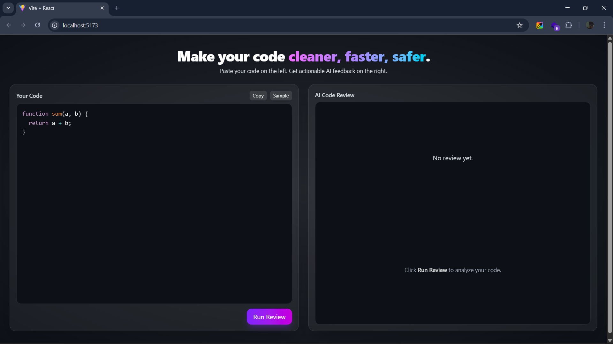
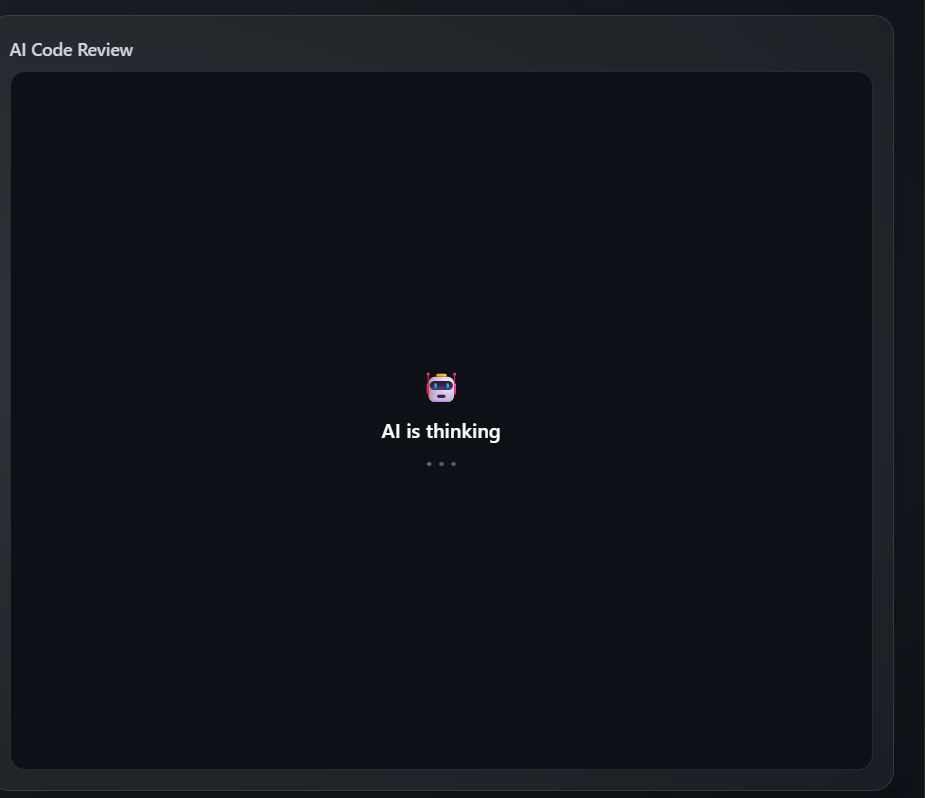
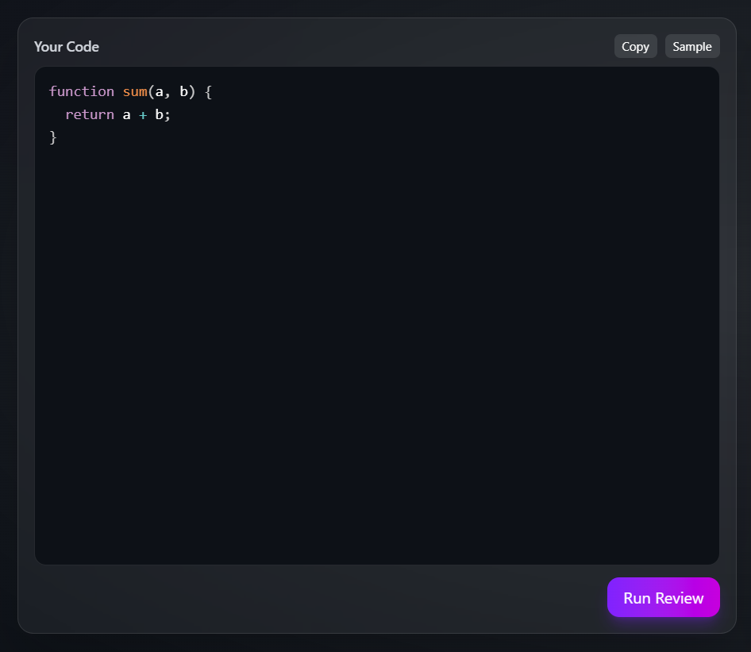

# 🤖 AI Powered Code Reviewer

AI Powered Code Reviewer is a full-stack application that helps developers improve their code by providing expert AI feedback, suggesting performance improvements, enhancing scalability, and ensuring clean, efficient code.

It works like your personal **senior developer**, reviewing your code in real time.

---

## 📌 Features
- Paste your code and get **instant AI-powered reviews**.
- Suggestions for **better efficiency, scalability, and readability**.
- Simple and modern **UI built with TailwindCSS**.
- Separate **frontend** (React) and **backend** (Express + Node.js).
- AI "thinking" loading animation before review results.
- Syntax highlighting for your code input.

---

## 🖼 Screenshots

### Home UI


### AI Thinking


### Example Code Review


---

## 🛠 Tech Stack

### Frontend
- **React.js**
- **Tailwind CSS**
- **Vite**
- Syntax Highlighting

### Backend
- **Node.js**
- **Express.js**
- **OpenAI API** (or your AI model)
- **Nodemon** (for development)

---

## 📂 Folder Structure
AI-PoweredCodeReviewer/
│
├── Backend/
│ ├── src/
│ │ ├── controllers/
│ │ ├── routes/
│ │ ├── services/
│ │ ├── app.js
│ │ ├── server.js
│ ├── .env
│ ├── package.json
│ ├── package-lock.json
│
├── Frontend/
│ ├── public/
│ ├── src/
│ │ ├── assets/
│ │ ├── App.jsx
│ │ ├── index.css
│ │ ├── main.jsx
│ ├── package.json
│ ├── vite.config.js
│
└── README.md


---

## ⚙ Installation & Setup

### 1️⃣ Clone the repository
```bash
git clone https://github.com/Rudra-744/Ai-Code_Reviewer.git
cd AI-PoweredCodeReviewer


### 2️⃣ Backend Setup
cd Backend
npm install

## Create a .env file in Backend/ with your API keys:
GOOGLE_GEMINI_API_KEY=your_api_key_here

### Run backend with:
npx nodemon


### Run frontend with:
npm run dev


🚀 Usage
Start Backend server:

cd Backend
npx nodemon
Start Frontend:


cd Frontend
npm run dev
Open browser at http://localhost:5173.

Paste your code in the left panel.

Click Run Review and wait for AI feedback.


📜 License
This project currently has no license. You can modify and use it for personal purposes.


💡 Future Improvements
Save reviews history.
Customizable AI prompt settings.

✨ Author
Rudra
💻 Built with ❤️ using React, Node.js, and AI.

## 🖼 Screenshots

### Home UI


### AI Thinking


### Example Code Review

